# 🌐 Fullstack Social Media Frontend

React + Tailwind CSS frontend for a full-stack social media application.  
Supports user authentication, real-time chat, stories, posts, notifications, reels, explore, profile, and home feed.

---

## 🌐 Live Demo
[Click here to view the live app](https://social-media-frontend-sigma-rosy.vercel.app/)

---

### ⚙️ Backend
[Backend Repo](https://github.com/ALIM23700/SocialMedia_Backend)

---

## 🛠 Tech Stack

- React.js  
- Tailwind CSS & DaisyUI  
- React Router DOM  
- Axios for API calls  
- Firebase Authentication & Realtime DB / Socket.IO  
- LocalStorage for temporary state (e.g., auth, draft posts)

---

## ✨ Features

- Fully responsive design for desktop & mobile  
- User authentication (signup/login/logout)  
- Real-time chat messaging  
- Stories to share temporary posts  
- Posts & Reels with likes, comments, and sharing  
- Notifications for likes, comments, follows, and messages  
- Explore & Home feed to discover content  
- User profile management  

---

## 📸 Screenshots

### Home Feed
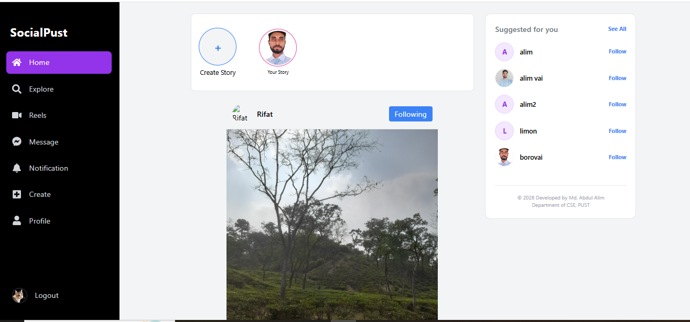  
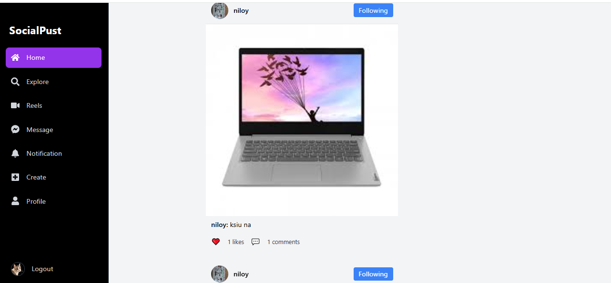

### Explore & Reels
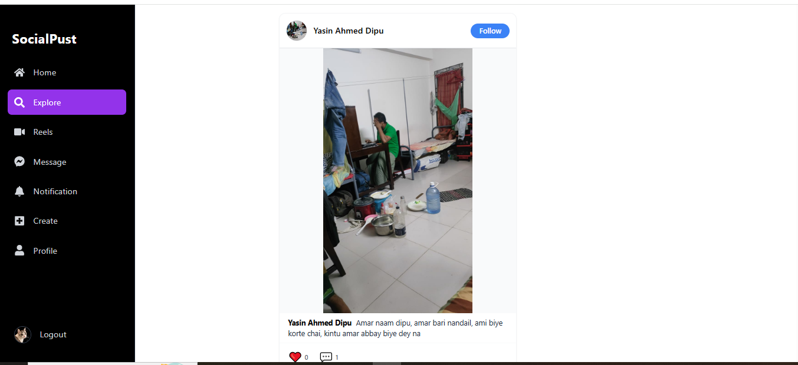  
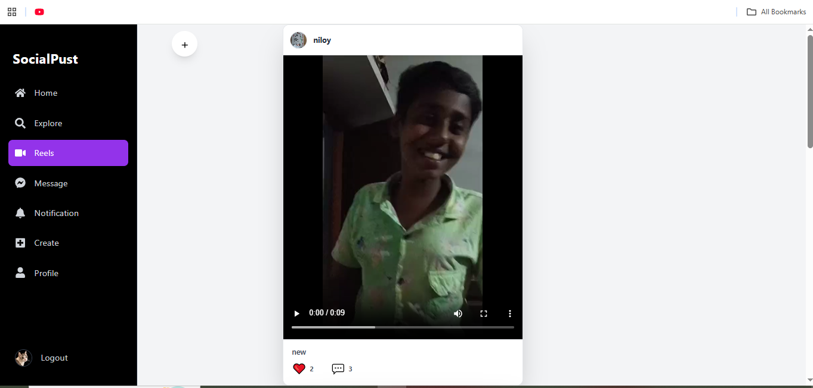

### Chat & Notifications
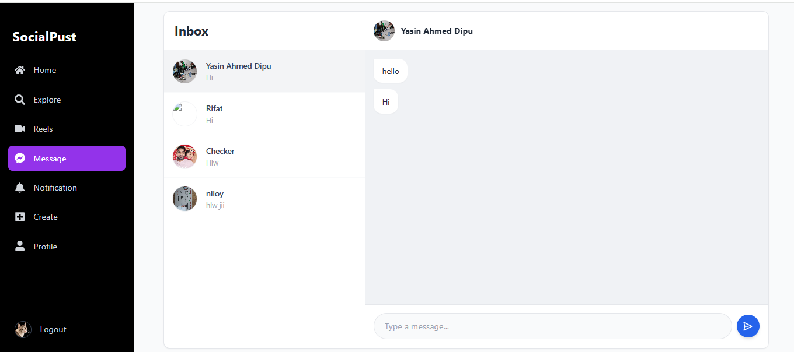  
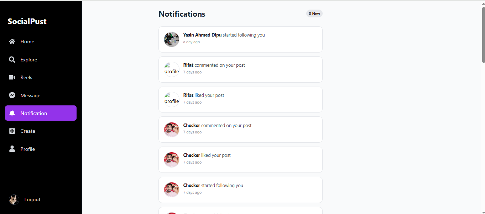

### Post & Create
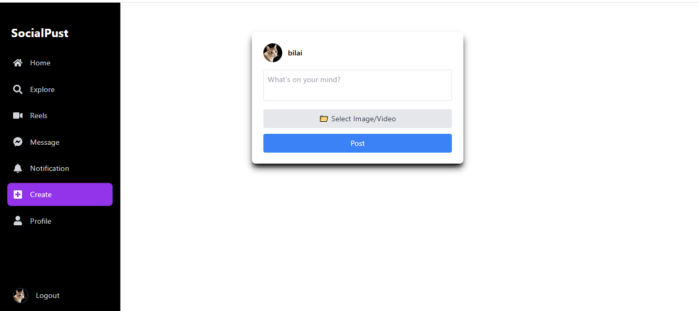  
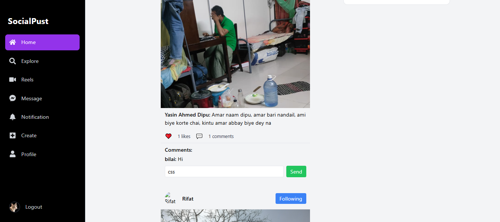

### Stories & Suggestions
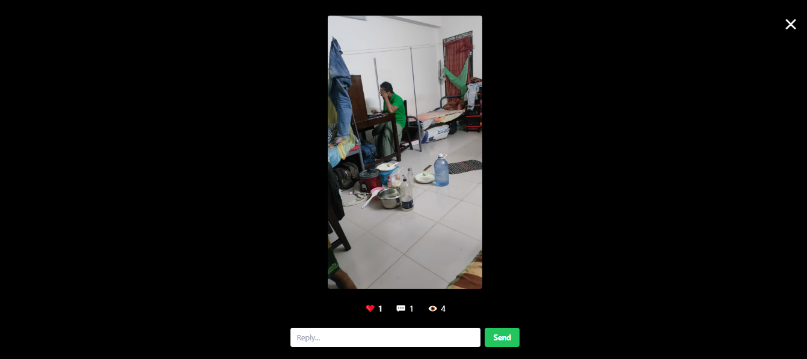  
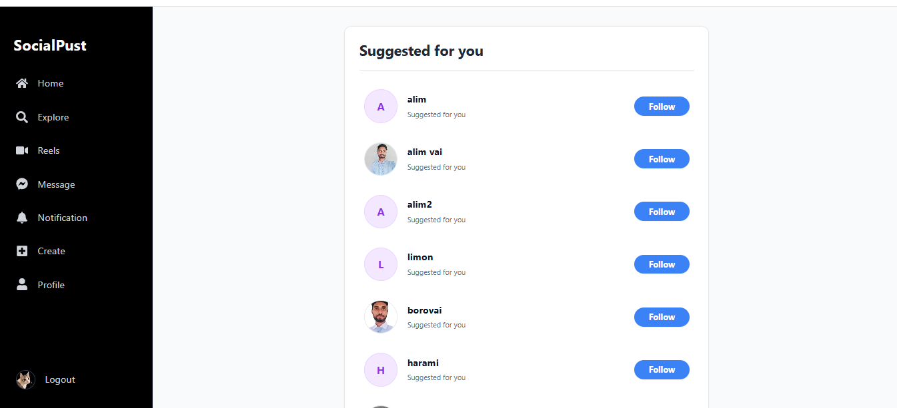

### User Profile & Auth
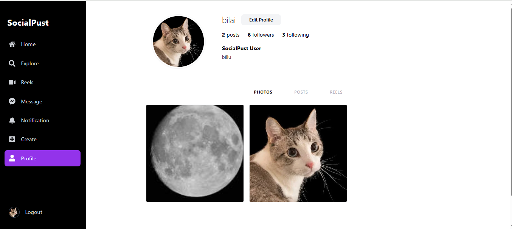  
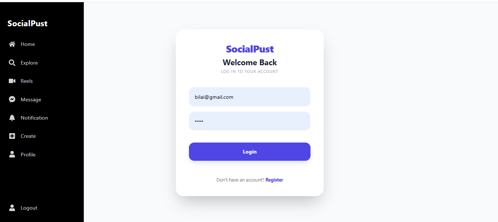  
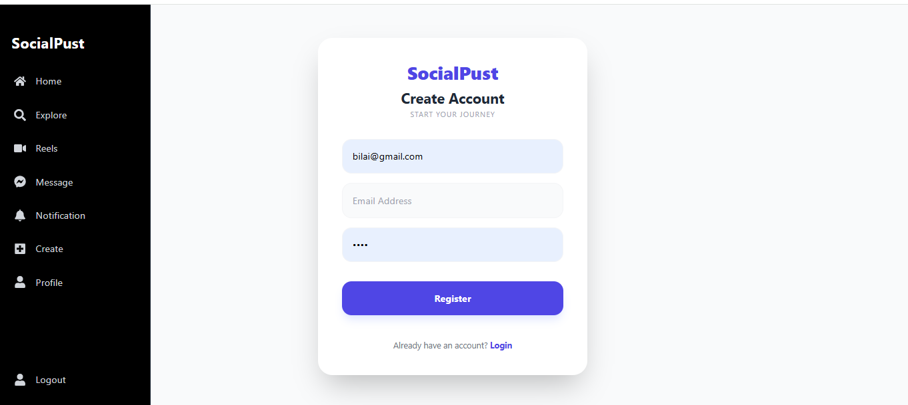

1. Clone the frontend repo  
git clone https://github.com/ALIM23700/SocialMedia_Frontend.git  

2. Navigate into the project folder  
cd SocialMedia_Frontend  

3. Install dependencies  
npm install  

4. Start the app locally  
npm start  

5. Open in browser at  
http://localhost:3000/  

Project Structure:  
src/  
app/ → Redux state management and Backend Url / Firebase setup  
components/ → Reusable UI components  
pages/ → Home, Explore, Profile, Reels, Stories, Chat pages  
App.js → Main router & page rendering  

Future Improvements:  
- Edit profile functionality  
- Save & share posts  
- Story highlights  
- Advanced search & explore filters  
- Push notifications  
- Post tagging & mentions  
- Dark mode  
- Analytics/dashboard for user engagement  

License:  
You are free to use, modify, and distribute this project.

---
